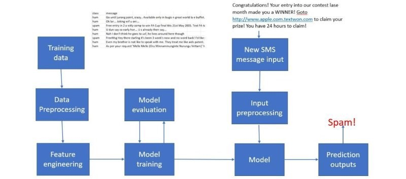
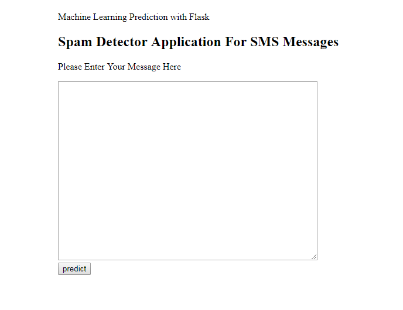
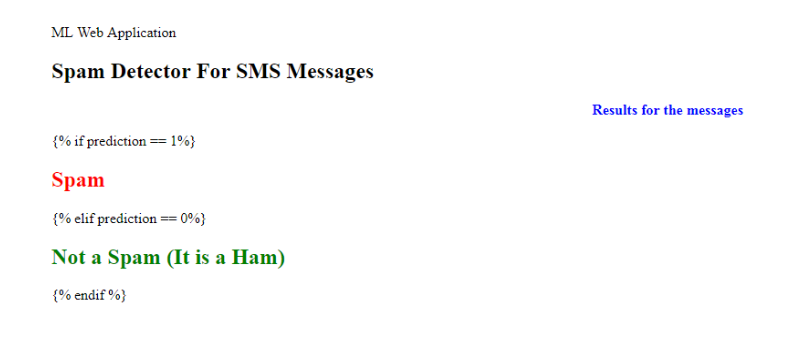

# NLP Model in Python & Deployed in Flask
> The aim of this project to build a machine learning model which can predict if a message/email is spam or not using NLP. 

## Table of contents
* [General info](#general-info)
* [Application Flow Diagram](#Application Flow Diagram)
* [Technologies](#technologies)
* [Setup](#setup)
* [Process](#process)
* [Code Examples](#code-examples)
* [Features](#features)
* [Status](#status)
* [Contact](#contact)

## General info
The workflow of the model looks like this: Train offline -> Make model available as a service -> Predict online. 
Steps involved:
1. A classifier is trained offline with spam and non-spam messages.
2. The trained model is then deployed as a web service to serve users.

## Application Flow Diagram

## Technologies
* Python - version 3.5
* sklearn

## Process

* I will be using the SMS Spam Collection Dataset which tags 5,574 text messages based on whether they are “spam” or “ham” (not spam).
* Build a classification model using Naive Bayes Classifier to classify which texts are spam.
* I used Naive Bayes Classifier because they are popular statistical technique for e-mail filtering.
* Turned the spam message classifier model into a web application using FLASK

## Features
* The model classifier classifies the input message in spam or non-spam with an accuracy of 93% 

The end product looks like this: 

## Status
Project is:  _finished_

## Contact

Created by me

If you loved what you read here and feel like we can collaborate to produce some exciting stuff, or if you
just want to shoot a question, please feel free to connect with me on <a href="dasanupriya2003@gmail.com" target="_blank">email</a>, 
<a href="https://www.linkedin.com/in/das-anupriya-89011019/" target="_blank">LinkedIn</a>

